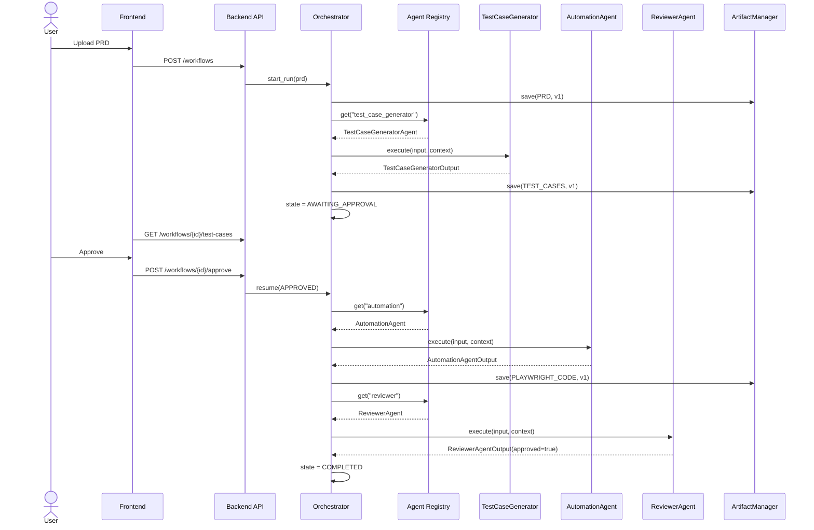
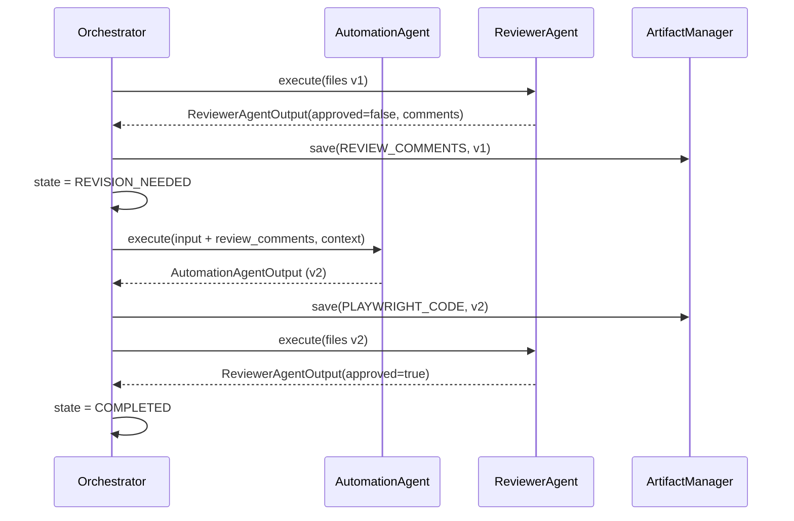

# AI QA Copilot — Architecture (Phase 1 + Phase 2)

Status: **interfaces & contracts approved for review — no business logic implemented yet.**

Phase 1 established the layered system, the Orchestrator-owns-no-business-logic principle, and the modular-monolith deployment model. Phase 2 adds the seams the architect review identified — Agent Registry, File/Git/Artifact services, LLM provider abstraction, Event Bus, prompt/memory versioning — and pins down every cross-boundary contract (Pydantic schemas, REST API, sequence diagrams) before any agent logic gets written.

---

## 1. Updated Folder Structure

```
ai-qa-copilot/
├── frontend/                        # React
│   └── src/{components,pages,hooks,api,types}/
│
├── backend/                         # FastAPI — API + Orchestrator host
│   └── app/
│       ├── api/                     # routers: workflows, approvals, agents
│       ├── orchestrator/            # engine.py, states.py — coordination only
│       ├── core/                    # DI container, bootstrap, settings loader
│       ├── domain/                  # WorkflowRun, WorkflowState, etc.
│       └── repositories/            # persistence interfaces + SQLite impls
│
├── agents/                          # each agent is a self-contained module
│   ├── base/
│   │   ├── agent_interface.py       # AgentProtocol
│   │   ├── registry.py              # AgentRegistry  [NEW]
│   │   └── schemas.py               # WorkflowContext, ValidationResult
│   ├── test_case_generator/
│   │   ├── agent.py
│   │   ├── prompts/{v1.md, v2.md}   # versioned  [CHANGED]
│   │   ├── config.yaml
│   │   ├── schemas.py
│   │   └── memory/{history.json, feedback.json}
│   ├── automation_agent/            # same shape
│   └── reviewer_agent/              # same shape + rules/
│
├── services/                        # [NEW] shared cross-agent capabilities
│   ├── interfaces.py                # FileServiceProtocol, GitServiceProtocol, ArtifactManagerProtocol
│   ├── file_service.py
│   ├── git_service.py               # interface + stub only, NotImplementedError
│   └── artifact_manager.py
│
├── llm/                              # [NEW] model abstraction, split out of knowledge/
│   ├── provider.py                   # LLMProvider Protocol
│   ├── providers/{ollama_provider.py, openai_provider.py, claude_provider.py}
│   └── router.py                     # resolves provider per configuration/models.yaml
│
├── knowledge/                        # RAG only now
│   ├── org_standards/
│   ├── pom_library/
│   ├── ingestion/                    # shared PDF/MD/Jira/text parsing
│   └── retriever/
│
├── events/                           # [NEW] interface only for now
│   └── event_bus.py
│
├── artifacts/                        # [NEW] replaces data/artifacts, owned by ArtifactManager
│   └── runs/<run_id>/{prd,test_cases,code,review}/v{n}/...
│
├── playwright/                       # generated, runnable automation project
│   └── {tests,pages,fixtures,utils}/
│
├── evaluation/
│   └── agent_evals/                  # LLM-as-judge rubrics per agent
├── guardrails/{schema_validators,content_policies,safety}/
├── configuration/
│   ├── agents.yaml                   # registry entries  [NEW]
│   ├── models.yaml                   # LLM provider routing
│   ├── workflow.yaml                 # orchestrator transition table
│   └── environments/
├── logs/
├── data/
│   └── runs.db                       # SQLite: WorkflowRun + artifact metadata index
└── docs/{architecture, adr}/
```

**What moved and why:**
- `services/` is split out of `agents/` — file, git, and artifact operations are capabilities multiple agents consume, not something any single agent owns. Putting them under `agents/` would have made e.g. a future Bug Agent import from inside Automation Agent's module, which breaks the isolation Phase 1 was built around.
- `llm/` is split out of `knowledge/` — model access (generation/embedding) and RAG (retrieval over a corpus) are different concerns that happened to be adjacent before. Separating them is what makes "swap Ollama for Claude" a one-file change instead of a search-and-replace through the retriever code.
- `artifacts/` is promoted to top-level and given an owner (`ArtifactManager`) instead of being a passive folder under `data/`. `data/` now holds only the SQLite metadata index.

---

## 2. Agent Registry

The Orchestrator must never import an agent class directly — it asks the registry for a name.

```python
# agents/base/registry.py

class AgentRegistry:
    def register(self, name: str, factory: Callable[[], AgentProtocol]) -> None: ...
    def get(self, name: str) -> AgentProtocol: ...
    def list_agents(self) -> list[str]: ...
```

Backed by `configuration/agents.yaml`:

```yaml
agents:
  test_case_generator:
    module: agents.test_case_generator.agent:TestCaseGeneratorAgent
    config: agents/test_case_generator/config.yaml
  automation:
    module: agents.automation_agent.agent:AutomationAgent
    config: agents/automation_agent/config.yaml
  reviewer:
    module: agents.reviewer_agent.agent:ReviewerAgent
    config: agents/reviewer_agent/config.yaml
```

`backend/app/core/bootstrap.py` reads this file at startup and registers a factory per entry (each factory closes over the agent's `LLMProvider`, `FileService`, `ArtifactManager`, and `EventBus` via constructor injection). `configuration/workflow.yaml` then references agents by string key (`"automation"`), never by class — adding a 10th agent is a two-line YAML change plus the agent module itself, with zero edits to `orchestrator/engine.py`.

---

## 3. Services Layer

```python
# services/interfaces.py

class FileServiceProtocol(Protocol):
    def write(self, path: str, content: str, run_id: str) -> FileRef: ...
    def read(self, path: str) -> str: ...
    def list(self, directory: str) -> list[str]: ...
    def delete(self, path: str) -> None: ...

class GitServiceProtocol(Protocol):
    """Interface only — no implementation until PR-comment feature is built."""
    def create_branch(self, run_id: str, base: str = "main") -> str: ...
    def commit(self, branch: str, message: str, files: list[str]) -> str: ...
    def push(self, branch: str) -> None: ...
    def open_pull_request(self, branch: str, title: str, body: str) -> PullRequestRef: ...
    def comment_on_pull_request(self, pr: PullRequestRef, comments: list["ReviewComment"]) -> None: ...

class ArtifactManagerProtocol(Protocol):
    def save(self, run_id: str, kind: "ArtifactKind", content: bytes | str, version: int | None = None) -> "ArtifactRef": ...
    def load(self, ref: "ArtifactRef") -> bytes: ...
    def list_versions(self, run_id: str, kind: "ArtifactKind") -> list["ArtifactRef"]: ...
    def compare(self, ref_a: "ArtifactRef", ref_b: "ArtifactRef") -> "DiffResult": ...
    def delete(self, ref: "ArtifactRef") -> None: ...
```

- **FileService** is the only component with disk-write permission for generated code. Automation Agent calls `file_service.write(...)`; it never touches `open()` directly. This is what lets Reviewer Agent and a future Bug/Migration Agent read the same files through the same path-resolution logic instead of each re-implementing it.
- **GitService** ships as interface + stub (`raise NotImplementedError`) per your instruction — this is the seam the "comment on GitHub PRs" future enhancement plugs into without touching agent code later.
- **ArtifactManager** sits on top of `FileService` for bytes-on-disk and the `data/runs.db` `artifacts` table for version metadata. `ArtifactKind` is an enum: `PRD`, `TEST_CASES`, `PLAYWRIGHT_CODE`, `REVIEW_COMMENTS`. `compare()` is what makes the revision loop show a real diff instead of just "here's the new version."

---

## 4. LLM Provider Abstraction

```python
# llm/provider.py

class LLMProvider(Protocol):
    def generate(
        self, prompt: str, *, system: str | None = None,
        temperature: float = 0.2, response_schema: type[BaseModel] | None = None,
    ) -> "LLMResponse": ...

    def embed(self, text: str) -> list[float]: ...
```

`OllamaProvider`, `OpenAIProvider`, `ClaudeProvider` all implement this Protocol. Agents depend on `LLMProvider`, never on a concrete client — swapping models is a `configuration/models.yaml` edit:

```yaml
default:
  provider: ollama
  model: qwen2.5

embedding:
  provider: ollama
  model: nomic-embed-text     # not qwen2.5 — see note below

agents:
  reviewer_agent:
    provider: ollama
    model: qwen2.5
    temperature: 0.1
```

**One correction worth flagging:** `qwen2.5` is a generation model, not an embedding model. `embed()` needs a dedicated embedding model pulled separately in Ollama (`nomic-embed-text` or `mxbai-embed-large`) — `models.yaml` routes generation and embedding independently so this doesn't get conflated later.

---

## 5. Event Bus (interface only)

```python
# events/event_bus.py

class WorkflowEvent(BaseModel):
    type: str            # e.g. "test_cases.generated", "review.completed"
    run_id: str
    payload: dict
    timestamp: datetime

class EventBusProtocol(Protocol):
    def publish(self, event: WorkflowEvent) -> None: ...
    def subscribe(self, event_type: str, handler: Callable[[WorkflowEvent], None]) -> None: ...
```

Today's implementation is synchronous and in-process — `publish()` invokes subscribed handlers immediately, so behavior is identical to direct method calls. The point of introducing it now isn't concurrency, it's that agents and the Orchestrator communicate by **named event**, not by direct reference. Swapping this file's internals for a real broker later (Redis pub/sub, etc.) touches nothing else. The WebSocket status updates the frontend receives (`GET /workflows/{id}/events`, §8) are themselves just a subscriber on this bus.

---

## 6. Agent Memory & Prompt Versioning

```
agents/automation_agent/
├── prompts/
│   ├── v1.md
│   └── v2.md
├── config.yaml            # prompt_version: v2
└── memory/
    ├── history.json       # [{run_id, input_hash, output_ref, timestamp}]
    └── feedback.json      # {run_id: [ReviewComment, resolved: bool]}
```

- **Prompt versioning**: `config.yaml` pins the active version per agent. `evaluation/agent_evals/` can replay the same input against `v1.md` and `v2.md` and score both — this is what turns "we improved the prompt" into a measurable regression test rather than a claim.
- **Memory**: when `AutomationAgentInput.review_comments` is non-empty (§7), the agent appends the comments and whether the regenerated code addressed them to `feedback.json`. This is structured context injection into the next prompt, not fine-tuning — "the Automation Agent learns from Reviewer comments" means *this run's prompt includes last run's unresolved feedback*, nothing heavier. Embedding this history into ChromaDB for long-term cross-run pattern recall is a plausible future enhancement, explicitly not built now.

---

## 7. Complete Pydantic Schemas

**Shared** (`agents/base/schemas.py`):

```python
class WorkflowState(str, Enum):
    PRD_RECEIVED = "prd_received"
    AWAITING_APPROVAL = "awaiting_approval"
    APPROVED = "approved"
    UNDER_REVIEW = "under_review"
    REVISION_NEEDED = "revision_needed"
    COMPLETED = "completed"
    REJECTED = "rejected"

class ArtifactKind(str, Enum):
    PRD = "prd"
    TEST_CASES = "test_cases"
    PLAYWRIGHT_CODE = "playwright_code"
    REVIEW_COMMENTS = "review_comments"

class ArtifactRef(BaseModel):
    run_id: str
    kind: ArtifactKind
    version: int
    path: str

class WorkflowContext(BaseModel):
    run_id: str
    state: WorkflowState
    previous_outputs: dict[str, ArtifactRef] = {}
    review_comments: list["ReviewComment"] = []

class ValidationResult(BaseModel):
    is_valid: bool
    errors: list[str] = []
    warnings: list[str] = []
```

**Test Case Generator** (`agents/test_case_generator/schemas.py`):

```python
class TestCaseGeneratorInput(BaseModel):
    run_id: str
    source_document: ArtifactRef        # pre-parsed to text by knowledge/ingestion
    module_hint: str | None = None

class TestCase(BaseModel):
    test_id: str
    module: str
    priority: Literal["P0", "P1", "P2", "P3"]
    description: str
    preconditions: list[str]
    steps: list[str]
    expected_result: str
    test_type: Literal["functional", "regression", "smoke", "edge_case", "negative"]
    automation_candidate: bool
    risk: Literal["low", "medium", "high"]

class TestCaseGeneratorOutput(BaseModel):
    run_id: str
    test_cases: list[TestCase]
    coverage_notes: str | None = None
```

**Automation Agent** (`agents/automation_agent/schemas.py`):

```python
class AutomationAgentInput(BaseModel):
    run_id: str
    approved_test_cases: list[TestCase]
    review_comments: list["ReviewComment"] = []   # empty on first pass, populated on revision
    existing_pom_refs: list[ArtifactRef] = []       # retrieved from pom_library via RAG

class GeneratedFile(BaseModel):
    path: str
    content: str
    file_type: Literal["test", "page_object", "fixture", "util"]

class AutomationAgentOutput(BaseModel):
    run_id: str
    files: list[GeneratedFile]
    test_case_coverage: dict[str, list[str]]        # test_id -> generated test names
```

**Reviewer Agent** (`agents/reviewer_agent/schemas.py`):

```python
class ReviewerAgentInput(BaseModel):
    run_id: str
    files: list[GeneratedFile]
    org_standards_refs: list[ArtifactRef] = []

class ReviewComment(BaseModel):
    file: str
    line: int | None = None
    rule: str                 # "no-hard-wait" | "no-xpath" | "pom-violation" | ...
    severity: Literal["blocker", "major", "minor", "info"]
    message: str
    suggested_fix: str | None = None

class ReviewerAgentOutput(BaseModel):
    run_id: str
    comments: list[ReviewComment]
    approved: bool             # true only if zero blocker/major comments
```

---

## 8. API Contract (Frontend ↔ Backend)

| Method | Path | Request | Response |
|---|---|---|---|
| POST | `/workflows` | multipart: PRD file | `{run_id, state}` |
| GET | `/workflows` | — | `[{run_id, state, created_at}]` |
| GET | `/workflows/{run_id}` | — | `WorkflowRun` |
| GET | `/workflows/{run_id}/test-cases` | — | `TestCaseGeneratorOutput` |
| POST | `/workflows/{run_id}/approve` | — | `{state: "approved"}` |
| POST | `/workflows/{run_id}/reject` | `{reason: str}` | `{state: "rejected"}` |
| GET | `/workflows/{run_id}/code` | — | `AutomationAgentOutput` |
| GET | `/workflows/{run_id}/review` | — | `ReviewerAgentOutput` |
| GET | `/workflows/{run_id}/artifacts/{kind}/versions` | — | `list[ArtifactRef]` |
| GET | `/workflows/{run_id}/artifacts/{kind}/diff?a={v}&b={v}` | — | `DiffResult` |
| WS | `/workflows/{run_id}/events` | — | stream of `WorkflowEvent` |
| GET | `/workflows/{run_id}/history` | — | `RevisionHistory` (§12) |

The WebSocket is an `EventBusProtocol` subscriber, not a separate mechanism — the frontend gets live state without polling, and it's the same event stream the Orchestrator itself consumes internally.

---

## 9. Sequence Diagrams

### 9.1 Happy path



### 9.2 Revision loop (Reviewer rejects)



---

## 10. Deferred (explicitly, not by omission)

- `services/git_service.py` — interface + `NotImplementedError` stub only.
- `events/event_bus.py` — synchronous in-process only; no external broker.
- `evaluation/rag_evals/` — folder placeholder; retrieval-quality metrics designed once a real corpus exists.
- ChromaDB embedding model must be `nomic-embed-text` (or similar), not `qwen2.5` — flagged in §4, not yet wired.

---

## 11. Revision History / Audit Trail

This is the demo centerpiece: a fully traceable record of what the Automation Agent generated, what the Reviewer found, what got resolved, and why the workflow ended the way it did.

**Design decisions:**

- **Computed, not stored.** No new persistent log. `RevisionHistoryBuilder` (`backend/app/domain/revision_history.py`) builds the trail on read by loading every `PLAYWRIGHT_CODE` and `REVIEW_COMMENTS` version for a `run_id` from `ArtifactManager` and pairing them by iteration. Single source of truth stays the versioned artifacts already in §3/§7; the history can never drift out of sync with them because it isn't a copy.
- **Resolution is judged by the Reviewer, not claimed by the Automation Agent.** A `ReviewComment` from iteration N is `resolved=true` if no comment with the same `(file, rule)` appears in iteration N+1's fresh review. Matching on `(file, rule)` rather than exact line number tolerates code shifting around during a fix. This deliberately avoids letting the Automation Agent self-report "✓ fixed" — that would be grading its own homework and is exactly the kind of claim a QA reviewer should distrust by default.
- **Line numbers aren't used for matching** because a fix commonly shifts every subsequent line in the file; `(file, rule)` is the stable identity of "this class of problem in this file."

```python
# backend/app/domain/revision_history.py

class CommentResolution(BaseModel):
    comment: ReviewComment              # from iteration N
    resolved: bool                      # true if absent (same file+rule) from iteration N+1's review

class RevisionEntry(BaseModel):
    run_id: str
    iteration: int                                  # 1-indexed
    code_ref: ArtifactRef                            # PLAYWRIGHT_CODE version generated this iteration
    review_ref: ArtifactRef                          # REVIEW_COMMENTS version reviewed against code_ref
    comments: list[ReviewComment]                    # what the Reviewer found this iteration
    resolutions_from_previous: list[CommentResolution] = []   # empty for iteration 1
    outcome: Literal["approved", "revision_needed", "revision_limit_exceeded"]
    timestamp: datetime

class RevisionHistory(BaseModel):
    run_id: str
    entries: list[RevisionEntry]
    final_outcome: Literal["completed", "revision_limit_exceeded", "rejected"]
```

**Event Bus integration:** each time the Orchestrator closes a `REVISION_NEEDED → automation → reviewer` cycle (§5, §9.2), it publishes `revision.completed` with that iteration's `RevisionEntry` on the existing `EventBusProtocol`. The frontend's `/workflows/{id}/events` subscriber (§8) renders the trail incrementally as it happens — in the demo, iterations 1–3 from your example appear live, not just as a final report:

```
Iteration 1 — Automation Agent generated login.spec.ts
  Reviewer:  ✗ hard-wait (blocker)   ✗ no-xpath (blocker)
Iteration 2 — Automation Agent regenerated login.spec.ts
  Resolved:  ✓ hard-wait   ✓ no-xpath
  Reviewer:  ✗ missing-assertion (major)
Iteration 3 — Automation Agent regenerated login.spec.ts
  Resolved:  ✓ missing-assertion
  Reviewer:  no blocker/major issues → APPROVED
Workflow Completed
```

**Frontend:** a dedicated timeline view on the workflow-detail page (`frontend/src/pages/RevisionHistory` or a tab within the run view) renders `RevisionHistory` — this is a first-class screen, not a debug log, since it's the artifact you'd actually put in front of the panel.

## 12. Revision Cap

The Reviewer ↔ Automation loop is bounded. `WorkflowState` gains `REVISION_LIMIT_EXCEEDED`; `WorkflowContext` gains a counter:

```python
class WorkflowState(str, Enum):
    ...
    REVISION_LIMIT_EXCEEDED = "revision_limit_exceeded"

class WorkflowContext(BaseModel):
    ...
    revision_count: int = 0
```

`configuration/workflow.yaml`:

```yaml
revision:
  max_attempts: 3
  on_limit_exceeded: escalate_to_human   # -> REVISION_LIMIT_EXCEEDED, not a silent loop
```

Orchestrator increments `revision_count` each time it routes `REVISION_NEEDED → automation`. On the Nth failure it transitions to `REVISION_LIMIT_EXCEEDED` instead of looping again — the run surfaces to the human (same approval surface as §8) with the full comment history rather than retrying against local Ollama indefinitely with no cost/time signal to stop it. This also gives `evaluation/agent_evals/` a concrete metric to track: average revisions-to-approval per prompt version.
